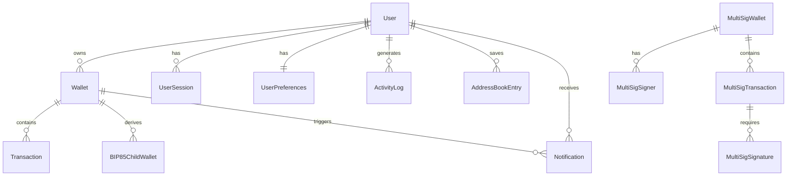

# Walletrix Database Architecture

A comprehensive overview of the PostgreSQL database schema and Prisma ORM implementation.

---

## 📊 Database Overview

| Metric | Value |
|--------|-------|
| **Database** | PostgreSQL |
| **ORM** | Prisma Client |
| **Total Models** | 15 |
| **Total Enums** | 6 |
| **Total Indexes** | 30+ |
| **Schema Lines** | 421 |

---

## 🗂️ Data Models

### User Management

#### User Model
**Table**: `users`

Core user entity with Clerk authentication integration.

| Column | Type | Description |
|--------|------|-------------|
| `id` | String | Clerk user ID (primary key) |
| `email` | String | Unique email address |
| `password_hash` | String? | Optional (OAuth users) |
| `password_hash_algorithm` | String | 'bcrypt' or 'argon2id' |
| `username` | String? | Unique username |
| `display_name` | String? | Display name |
| `email_verified` | Boolean | Email verification status |
| `is_active` | Boolean | Account active status |
| `two_factor_enabled` | Boolean | 2FA status |
| `two_factor_secret` | String? | Encrypted TOTP secret |
| `google_id` | String? | Google OAuth ID |
| `profile_picture` | String? | Profile picture URL |
| `auth_provider` | String | 'local', 'google', 'clerk' |
| `last_login_at` | DateTime? | Last login timestamp |

**Indexes**: `email`, `username`, `is_active`

**Relations**:
- `wallets` → Wallet[]
- `sessions` → UserSession[]
- `preferences` → UserPreferences
- `activityLogs` → ActivityLog[]
- `addressBook` → AddressBookEntry[]
- `notifications` → Notification[]

---

#### UserSession Model
**Table**: `user_sessions`

JWT session management with device tracking.

| Column | Type | Description |
|--------|------|-------------|
| `id` | cuid | Primary key |
| `user_id` | String | Foreign key to User |
| `session_token` | String | Unique session token |
| `refresh_token` | String | Unique refresh token |
| `expires_at` | DateTime | Token expiration |
| `last_used_at` | DateTime | Last activity |
| `ip_address` | String? | Client IP |
| `user_agent` | String? | Browser/device info |
| `is_active` | Boolean | Session status |

**Indexes**: `userId`, `sessionToken`, `refreshToken`, `expiresAt`

---

#### UserPreferences Model
**Table**: `user_preferences`

User customization and settings.

| Column | Type | Description |
|--------|------|-------------|
| `user_id` | String | Primary key (FK to User) |
| `default_network` | String | Default blockchain network |
| `preferred_currency` | String | Fiat currency (USD, EUR) |
| `theme` | String | UI theme (dark/light) |
| `language` | String | Language code |
| `timezone` | String | User timezone |
| `notifications` | Json | Notification preferences |
| `privacy_settings` | Json | Privacy configuration |

---

### Wallet Management

#### Wallet Model
**Table**: `wallets`

HD and imported wallet storage with encryption.

| Column | Type | Description |
|--------|------|-------------|
| `id` | cuid | Primary key |
| `user_id` | String | Foreign key to User |
| `name` | String | Wallet name |
| `description` | String? | User description |
| `wallet_type` | String | 'hd', 'imported', 'hardware' |
| `encrypted_mnemonic` | String? | AES-256-GCM encrypted seed |
| `encrypted_private_keys` | Json | Network-specific encrypted keys |
| `addresses` | Json | `{"ethereum": "0x...", "bitcoin": "bc1..."}` |
| `derivation_path` | String? | HD derivation path |
| `is_active` | Boolean | Wallet status |
| `last_accessed_at` | DateTime | Last access time |

**Indexes**: `userId`, `isActive`, `walletType`

**Relations**:
- `transactions` → Transaction[]
- `bip85Children` → BIP85ChildWallet[]
- `notifications` → Notification[]

---

#### BIP85ChildWallet Model
**Table**: `bip85_child_wallets`

Deterministically derived child wallets.

| Column | Type | Description |
|--------|------|-------------|
| `id` | cuid | Primary key |
| `parent_wallet_id` | String | Foreign key to Wallet |
| `child_index` | Int | BIP-85 derivation index |
| `word_count` | Int | Mnemonic word count (12/18/24) |
| `derivation_path` | String | Full derivation path |
| `encrypted_mnemonic` | String | Encrypted child mnemonic |
| `addresses` | Json | Child wallet addresses |
| `label` | String? | User-defined label |

**Constraints**: Unique `[parentWalletId, childIndex]`

---

### Multi-Signature Wallets

#### MultiSigWallet Model
**Table**: `multisig_wallets`

M-of-N multi-signature wallet configuration.

| Column | Type | Description |
|--------|------|-------------|
| `id` | cuid | Primary key |
| `user_id` | String | Creator user ID |
| `name` | String | Wallet name |
| `network` | String | 'bitcoin' or 'ethereum' |
| `wallet_type` | String | 'p2sh', 'p2wsh', 'gnosis-safe' |
| `address` | String | Multi-sig address |
| `required_signatures` | Int | M (threshold) |
| `total_signers` | Int | N (total signers) |
| `redeem_script` | String? | Bitcoin redeem script |
| `configuration` | Json? | Gnosis Safe config |

**Indexes**: `userId`, `address`, `isActive`

---

#### MultiSigSigner Model
**Table**: `multisig_signers`

Individual signers for multi-sig wallets.

| Column | Type | Description |
|--------|------|-------------|
| `id` | cuid | Primary key |
| `multisig_wallet_id` | String | FK to MultiSigWallet |
| `user_id` | String? | Null if external signer |
| `public_key` | String | Signer's public key |
| `address` | String | Signer's address |
| `label` | String? | Signer name |
| `order` | Int | Signer order/position |

**Constraints**: Unique `[multiSigWalletId, publicKey]`

---

#### MultiSigTransaction Model
**Table**: `multisig_transactions`

Pending multi-sig transactions awaiting signatures.

| Column | Type | Description |
|--------|------|-------------|
| `id` | cuid | Primary key |
| `multisig_wallet_id` | String | FK to MultiSigWallet |
| `to_address` | String | Recipient address |
| `amount` | Decimal(36,18) | Transaction amount |
| `token_symbol` | String | Token symbol |
| `data` | String? | Transaction data |
| `status` | String | 'pending', 'ready', 'executed', 'rejected' |
| `required_signatures` | Int | Signatures needed |
| `current_signatures` | Int | Signatures collected |
| `tx_hash` | String? | Executed TX hash |
| `executed_at` | DateTime? | Execution timestamp |

**Indexes**: `multiSigWalletId`, `status`

---

#### MultiSigSignature Model
**Table**: `multisig_signatures`

Individual signatures for multi-sig transactions.

| Column | Type | Description |
|--------|------|-------------|
| `id` | cuid | Primary key |
| `multisig_transaction_id` | String | FK to MultiSigTransaction |
| `signer_id` | String | Signer identifier |
| `signature` | String | Cryptographic signature |
| `signed_at` | DateTime | Signature timestamp |

**Constraints**: Unique `[multiSigTransactionId, signerId]`

---

### Transactions

#### Transaction Model
**Table**: `transactions`

Optimized transaction storage with high precision.

| Column | Type | Description |
|--------|------|-------------|
| `id` | cuid | Primary key |
| `wallet_id` | String | FK to Wallet |
| `network` | String | Blockchain network |
| `tx_hash` | String | Transaction hash |
| `block_number` | BigInt? | Block number |
| `from_address` | String | Sender address |
| `to_address` | String | Recipient address |
| `amount` | Decimal(36,18) | High precision amount |
| `token_symbol` | String | Token symbol |
| `token_address` | String? | ERC-20 token address |
| `token_decimals` | Int | Token decimals |
| `status` | String | 'pending', 'confirmed', 'failed' |
| `gas_used` | BigInt? | Gas consumed |
| `gas_price` | Decimal(36,0) | Gas price in wei |
| `nonce` | Int? | Transaction nonce |
| `transaction_fee` | Decimal(36,18) | Total fee |
| `is_incoming` | Boolean | Direction flag |
| `usd_value_at_time` | Decimal(15,2) | USD value at TX time |
| `category` | String | 'transfer', 'swap', 'defi', 'nft' |
| `metadata` | Json? | Additional data |

**Constraints**: Unique `[txHash, network]`

**Indexes**: `walletId`, `wallet_transactions_by_time`, `status`, `network`, `tokenSymbol`, `category`, `amount`

---

### Security & Audit

#### ActivityLog Model
**Table**: `activity_logs`

Complete security audit trail.

| Column | Type | Description |
|--------|------|-------------|
| `id` | cuid | Primary key |
| `user_id` | String? | FK to User (nullable) |
| `action` | String | Action performed |
| `resource_type` | String? | Resource type modified |
| `resource_id` | String? | Resource identifier |
| `details` | Json? | Action details |
| `ip_address` | String? | Client IP address |
| `user_agent` | String? | Browser/device |
| `success` | Boolean | Action success status |
| `timestamp` | DateTime | Event timestamp |

**Indexes**: `userId`, `timestamp(sort: Desc)`, `action`

---

#### ScamAddress Model
**Table**: `scam_addresses`

Known malicious addresses database.

| Column | Type | Description |
|--------|------|-------------|
| `address` | String | Primary key (address) |
| `reason` | String? | Why flagged |
| `source` | String? | 'reported', 'verified', 'automated' |
| `severity` | String | 'low', 'medium', 'high', 'critical' |
| `verified_at` | DateTime? | Verification timestamp |

---

#### SuspiciousAddress Model
**Table**: `suspicious_addresses`

Addresses pending review.

| Column | Type | Description |
|--------|------|-------------|
| `address` | String | Primary key (address) |
| `reason` | String? | Suspicion reason |
| `flagged_by` | String? | Who flagged |
| `reviewed` | Boolean | Review status |

---

### Address Book

#### AddressBookEntry Model
**Table**: `address_book`

Saved contacts for easy transfers.

| Column | Type | Description |
|--------|------|-------------|
| `id` | cuid | Primary key |
| `user_id` | String | FK to User |
| `name` | String | Contact name |
| `address` | String | Wallet address |
| `network` | String | Blockchain network |
| `notes` | String? | User notes |
| `is_favorite` | Boolean | Favorite status |

**Constraints**: Unique `[userId, address, network]`

---

#### AddressBook Model (Enhanced)
**Table**: `address_books`

Enhanced address book with trust levels.

| Column | Type | Description |
|--------|------|-------------|
| `trusted` | Boolean | Trusted address flag |
| `is_active` | Boolean | Active status |

---

### Notifications

#### Notification Model
**Table**: `notifications`

User and wallet notifications.

| Column | Type | Description |
|--------|------|-------------|
| `id` | cuid | Primary key |
| `user_id` | String | FK to User |
| `wallet_id` | String? | FK to Wallet (optional) |
| `type` | String | Notification type |
| `title` | String | Notification title |
| `message` | String | Notification body |
| `data` | Json? | Additional data |
| `is_read` | Boolean | Read status |
| `action_url` | String? | Click action URL |

**Indexes**: `[userId, isRead]`, `[walletId, isRead]`, `createdAt`

---

### Caching

#### PriceCache Model
**Table**: `price_cache`

Cryptocurrency price caching.

| Column | Type | Description |
|--------|------|-------------|
| `symbol` | String | Primary key (ticker) |
| `name` | String | Coin name |
| `price_usd` | Decimal(15,8) | Current USD price |
| `market_cap` | Decimal(20,2) | Market cap |
| `volume_24h` | Decimal(20,2) | 24h volume |
| `change_24h` | Decimal(10,4) | 24h change % |
| `change_7d` | Decimal(10,4) | 7d change % |
| `last_updated` | DateTime | Cache timestamp |

---

## 📋 Enums

```prisma
enum WalletType {
  HD       @map("hd")
  IMPORTED @map("imported")
  HARDWARE @map("hardware")
}

enum TransactionStatus {
  PENDING   @map("pending")
  CONFIRMED @map("confirmed")
  FAILED    @map("failed")
  DROPPED   @map("dropped")
}

enum TransactionCategory {
  TRANSFER @map("transfer")
  SWAP     @map("swap")
  DEFI     @map("defi")
  NFT      @map("nft")
  CONTRACT @map("contract")
}

enum ActivityAction {
  LOGIN              @map("login")
  LOGOUT             @map("logout")
  WALLET_CREATE      @map("wallet_create")
  WALLET_DELETE      @map("wallet_delete")
  TRANSACTION_SEND   @map("transaction_send")
  SETTINGS_UPDATE    @map("settings_update")
  PASSWORD_CHANGE    @map("password_change")
  TWO_FA_ENABLE      @map("2fa_enable")
  TWO_FA_DISABLE     @map("2fa_disable")
}
```

---

## 🔗 Entity Relationship Diagram



---

## 🎯 Performance Optimizations

### Indexes Strategy

| Table | Index | Purpose |
|-------|-------|---------|
| `transactions` | `wallet_transactions_by_time` | Fast chronological queries |
| `transactions` | `[txHash, network]` | Unique transaction lookup |
| `user_sessions` | `[sessionToken]`, `[refreshToken]` | Fast token validation |
| `notifications` | `[userId, isRead]` | Unread notification counts |
| `activity_logs` | `[timestamp DESC]` | Recent activity queries |

### Decimal Precision

| Field | Precision | Use Case |
|-------|-----------|----------|
| `amount` | Decimal(36,18) | Full 18-decimal token support |
| `gas_price` | Decimal(36,0) | Wei-level precision |
| `usd_value` | Decimal(15,2) | Standard currency |
| `price_usd` | Decimal(15,8) | Crypto price precision |

---

## 🔒 Security Features

1. **Cascade Deletes**: User deletion removes all related data
2. **Encrypted Fields**: `encrypted_mnemonic`, `encrypted_private_keys`, `two_factor_secret`
3. **Audit Trail**: Complete `ActivityLog` for all operations
4. **Scam Protection**: `ScamAddress` and `SuspiciousAddress` tables
5. **Session Tracking**: IP and user-agent logging

---

## 📈 Schema Statistics

| Category | Count |
|----------|-------|
| **User Models** | 3 (User, Session, Preferences) |
| **Wallet Models** | 2 (Wallet, BIP85Child) |
| **Multi-Sig Models** | 4 (Wallet, Signer, Transaction, Signature) |
| **Security Models** | 3 (ActivityLog, ScamAddress, SuspiciousAddress) |
| **Address Models** | 2 (AddressBookEntry, AddressBook) |
| **Other Models** | 3 (Transaction, Notification, PriceCache) |
| **Total Indexes** | 30+ |
| **Unique Constraints** | 8 |

---

*Last Updated: January 2026*
